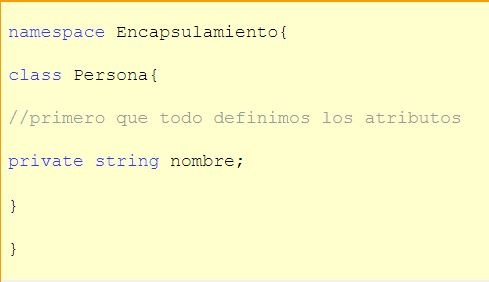
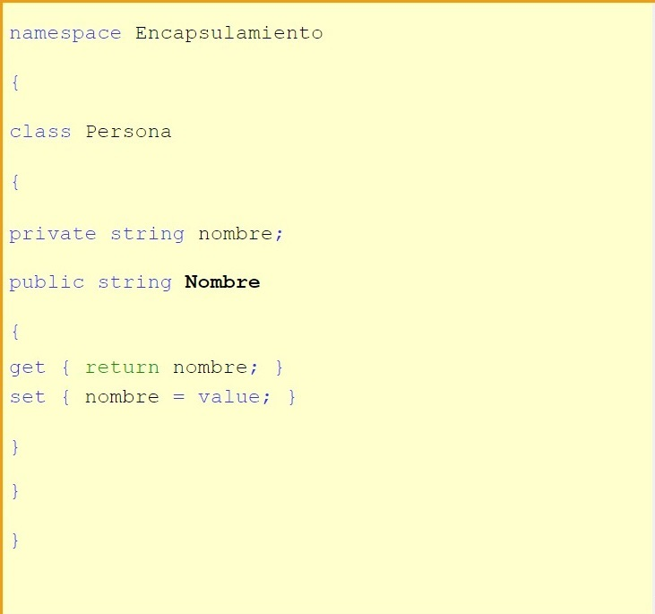
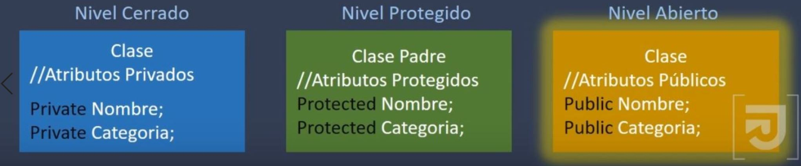
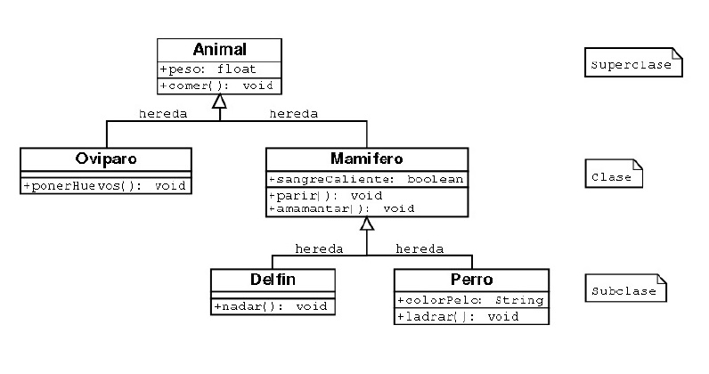
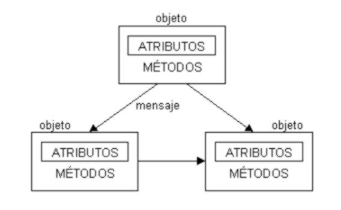
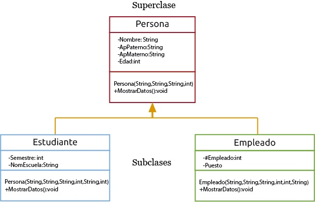

# 
Tarea Unidad 1

## 
 Con tus palabras, pero investigando define los siguientes conceptos

**1-.** Paradigma.

**2-.** Abstracción, da dos ejemplos.

**3-.** ¿Por qué decimos que la Clase es el mecanismo de abstracción de los lenguajes OO?.

**4-.** Explica el concepto de encapsulamiento, busca dos imágenes que te ayuden a describir el concepto, una que tenga algún sistema sin encapsulamiento y otra donde si lo tenga. Menciona por que es importante y que problemas puede evitar.

**5-.** Describe con tus palabras el concepto de herencia e ilustra el concepto con imágenes.
___

**1-.** Es un estilo o método de desarrollo de programación.

**2-.** Son las propias características de un objeto el cual se distingue de los demás;

* Por ejemplo, si tomamos como objeto un carro podemos obtener o "abstraer" su marca, año, color, etc.
* Otra seria con animales por ejemplo un perro el cual podemos diferenciar por el pelaje, raza, tamaño, etc.
  
**3-.** Porque en ellos nosotros "guardamos" la información básica referente a los objetos.

**4-.** Consiste en almacenar las características de los objetos, por base de la abstracción, y que se encuentran en una clase. Se representan por medio de atributos y métodos.

También se puede describir como ocultamiento de los cuales existen varios.

**5-.** Permite crear otros objetos referentes a los ya existentes obteniendo características similares.
por ejemplo, el obj. gato y el obj. perro tiene la herencia de "Mamífero".

Estos son otros ejemplos.

